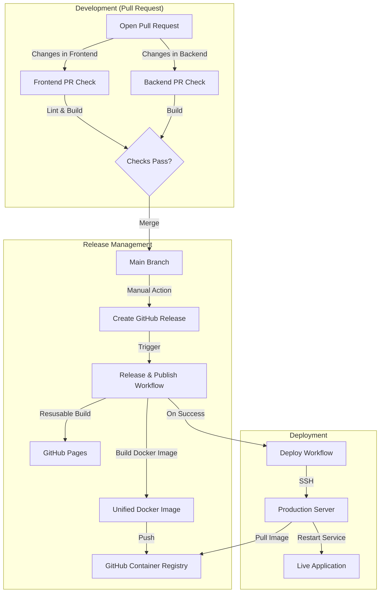

# Pipelines CI/CD Documentation

This document explains the CI/CD system implemented for **Process Flow**, using **GitHub Actions**.

## Overview

The project uses a strategy based on GitHub Actions to ensure code quality, automate container builds, and manage deployments.

The pipelines are divided into three main categories:

1.  **Pull Request Checks (`*-pr.yml`)**: They validate the code before merging.
2.  **Release & Publish (`release-publish.yml`)**: It builds and publishes the unified Docker image and the static frontend demo.
3.  **Deployment (`deploy.yml`)**: It automatically deploys the new image to production.

---

## 1. Pull Request Checks

These workflows run automatically when a Pull Request is opened or updated targeting the `main` branch.

### Frontend PR Check (`frontend-pr.yml`)

- **Trigger**: Changes in `apps/frontend/**`, `packages/common/**`.
- **Actions**:
  - Reuses the `reusable-frontend-build.yml` workflow.
  - **Linting**: Checks code style and potential errors.
  - **Build**: Compiles the frontend application to ensure there are no build errors.
  - **Artifacts**: Saves the compiled build (`dist`) for 2 days for review if needed.

### Backend PR Check (`backend-pr.yml`)

- **Trigger**: Changes in `apps/backend/**`, `packages/common/**`.
- **Actions**:
  - Setups Node.js and PNPM.
  - **Build**: Compiles the Common package and then the Backend (NestJS).
  - Ensures that dependency injection and types are correct.

---

## 2. Release & Publish (`release-publish.yml`)

This is the main workflow triggered **manually** when a new Release is published in GitHub.

- **Trigger**: Release created (Event: `type: published`).
- **Process**:
  1.  **Container Registry Login**: Authenticates with GitHub Container Registry (GHCR).
  2.  **Docker Build**:
      - Builds the **Unified Docker Image**.
      - Tags it with the release version (e.g., `v1.0.0`) and `latest`.
      - Pushes to `ghcr.io/mannuluss/process-flow-ui`.
  3.  **GitHub Pages Deployment**:
      - Reuses the `reusable-frontend-build.yml` workflow to compile the frontend cleanly.
      - Deploys the artifact to GitHub Pages for the live demo.

---

## 3. Automatic Deployment (`deploy.yml`)

This workflow runs **after** a successful completion of the `Release and Publish` workflow.

- **Trigger**: `workflow_run` (on success of "Release and Publish").
- **Process**:
  1.  Connects to the production server via **SSH**.
  2.  Executes the following commands:
      - `docker pull ...`: Downloads the new image (tagged `latest` or specific version).
      - `docker-compose up -d`: Restarts the service.
- **Requirements**:
  - Secrets configured in GitHub: `SSH_HOST`, `SSH_USERNAME`, `SSH_PRIVATE_KEY`.

---

## Pipelines Flow Diagram

## Docker Image Strategy

- **Unified Image**: We use a single image where NestJS serves the static React files.
- **Plug-and-Play**: The image is pre-built on GHCR. Users can run it with a simple `docker-compose up` without needing to build locally.
- **Base Path**: The frontend is built with `VITE_BASE_PATH=/ui/` to ensure routing works correctly when served under the `/ui` subpath by NextJS.
